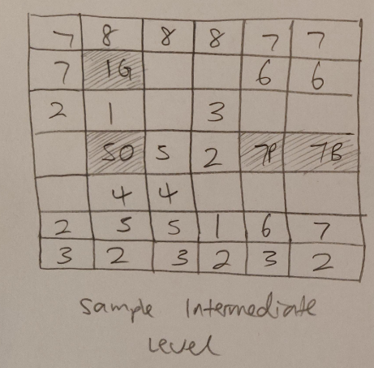

# Game Plan
## NAME: Alex Xu
## NetID: aqx

### Breakout Variant
In Super Breakout, I thought the variation in 'durability' for different blocks was 
interesting, and increased the difficulting of the game, requiring players to use more 
creativity and strategy to pass certain levels. In addition, power-ups like score boosts,
 multiple balls, and laser shots enhanced the game experience by adding game mechanisms. 
 This made the game more interesting and less mundane.

I also liked the puzzle strategy mechanism in Bricks n Balls. It allows the player to 
aim and strategize what is the best course of action based on the remaining 'health' 
of certain blocks to be cleared. In addition, the blocks are constant regenerated in a 
scrolling fashion, and the goal of the game is to survive as long as possible without 
the blocks scrolling to the bottom of the screen (which contrasts with the classic 
Breakout game, where there are levels to be cleared).

### General Level Descriptions

I plan on making each level different, so the player can not rely on a single strategy to win. Here are some pictures of
 sample levels I plan on making:
 

(Above) Sample Easy/Intro Level (Power-up blocks shaded to make it easier to see).

(Above) Sample Intermediate Level (more rows, blocks have more hit points and more strategy is needed to navigate around 
configuration).

(Above) Sample Hard Level (more rows, more complex, puzzle-like geometry, and guarding of valuable life power-up).

The numbers indicate the number of hit points each brick will have. Letters (B P G O) indicate the color of the block, 
if any. The colors (Blue, Purple, Green, Orange, respectively) are for power-ups (explained in the sections below).

These level designs will be implemented into a text format, so the game can read the file and set the level up 
accordingly.

### Bricks Ideas

I plan on creating three main types of bricks:

1. Bricks of different durability/health levels/hit points (as indicated by color or number placed on them, telling the 
player how many ?lives? are left on that particular brick.) As of now I plan on making this hit point number range from 
1 to 9.

2. Bricks that drop certain power-ups (as indicated by the color that corresponds to the power-up): When a player uses the 
ball to break one of these blocks, a power-up that corresponds to the block color will drop vertically down, allowing 
the player to use the paddle to ?pick it up? and activate its effect. Please see the section below for more information 
about power-ups and their corresponding colors.

3. ?Bonus? bricks that are worth double the amount of points as regular bricks, but have the same health: These bricks 
behave the same as regular bricks (with a certain amount of hit points, as expected), but they will award the player 
with double the amount of points when they are damaged/destroyed. These bricks will be marked by their **gold** colored 
font/number.

### Power Up Ideas

I plan on implementing the power-ups in a way so that their effects wear off after a period of time (after a certain 
amount of frames or refreshes of the game loop). In addition, I plan on designing the game so that only **one** power-up can
 be active at a given time (the most recently activated one).

1. **Paddle lengthening** (Blue brick): This power-up will double the length of the paddle, making it easier for the player to 
move the paddle in the way of the ball (preventing the ball from hitting the bottom edge of the screen and losing a 
life). The length of the paddle is subject to adjustment during implementation.

2. **Ball slowing** (Purple brick): This makes the ball travel slower, so the player can better react to different/changing 
situations. I plan on first setting this slowed speed to 0.75 times the original speed, and adjust this value if needed 
during the implementation of the game.

3. **Additional Life** (Green brick): This power-up adds a single life to the player, giving the player an additional chance to
 make a mistake. Because of how helpful this power-up is, I only plan on making this power-up show up sparingly in the 
 game. In addition, this power-up has no ?duration.? The effect is instantaneous.

4. **Super ball** (Orange brick): This makes the ball more ?durable?, allowing it to do two hit points worth of damage to 
bricks, instead of one. In addition, this power-up makes the radius of the ball bigger and makes the movement of the 
ball slower so it gives the player a sense of increased ?weight?. I plan on increasing the diameter of the ball by 50% 
and slowing the speed of the ball to 0.75 times, but I will adjust these values accordingly during implementation.

### Cheat Key Ideas

- **Add a life** (L): Adds a single life to the player?s remaining lives count.

- **Jump to a certain level** (1-9): Allows the player to bypass levels and go directly to a certain level.

- **Resets ball to starting position** (R): Allows the player to reset/call back the ball to the starting position, without 
losing a life.
#### My own additional cheat keys:
- **Bottom Bounce** (B): This makes ball bounce off of bottom edge as well, until disabled by pressing the same button. This essentially makes 
the player invincible, as the player can not lose in this situation. The ball will continuously bounce around the sides.

- **Reduce Hitpoints** (H): Reduces durability/health of all blocks to 1 hit point. This makes a certain level much easier has each block will be 
destroyed after a single hit, regardless of how many hit points they were originally designed to be. This will update the hit point marker of each block as well.

### Something Extra

As the player progresses (score increases or level increases), the speed of the paddle increases (and/or the length of 
the paddle decreases), making it harder to control and deflect the incoming ball. This addition would increase the 
difficulty of the game as the player becomes better at the game. Furthermore, it will give more experienced players a 
challenging and more enjoyable experience as compared to if the difficulty of the levels remained the same as the player 
progressesed. This would be a substantial addition, as the ?difficulty curve? of the game would be trending upward, 
replacing the flat difficulty curve of a game that did not include this feature.

To build upon this, one ?endgame? feature I plan on implementing in the last stage/level is having certain select rows 
of blocks be mobile, sliding across the screen from left to right. This increases the difficulty of the game 
significantly, as is appropriate for the final level. Please see the images included above in the previous section for 
an idea of this.

Furthermore, something else that is not yet mentioned is that I plan to design the game in a way so that where the ball 
hits the paddle affects where the ball where go. This would make the game more dynamic and allow the player to more 
precisely control where they would want to ball to go.
